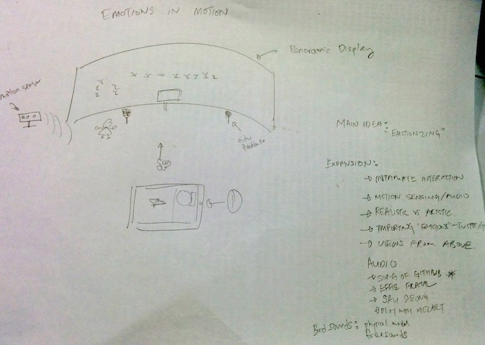
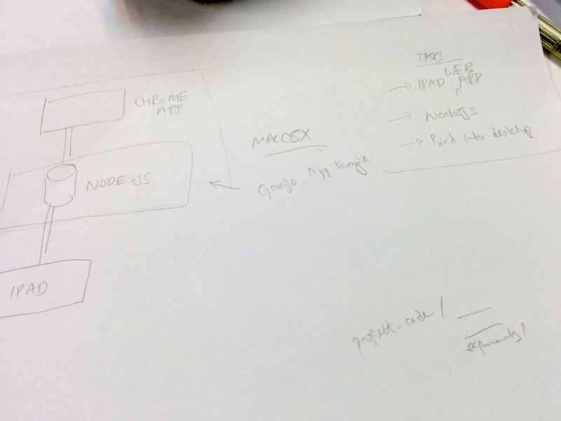
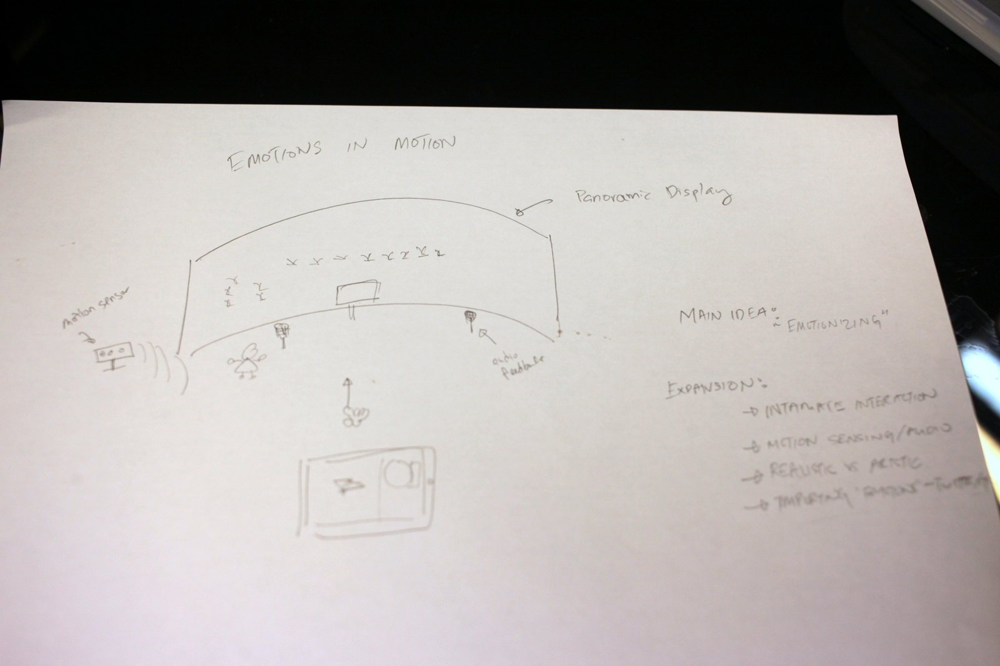
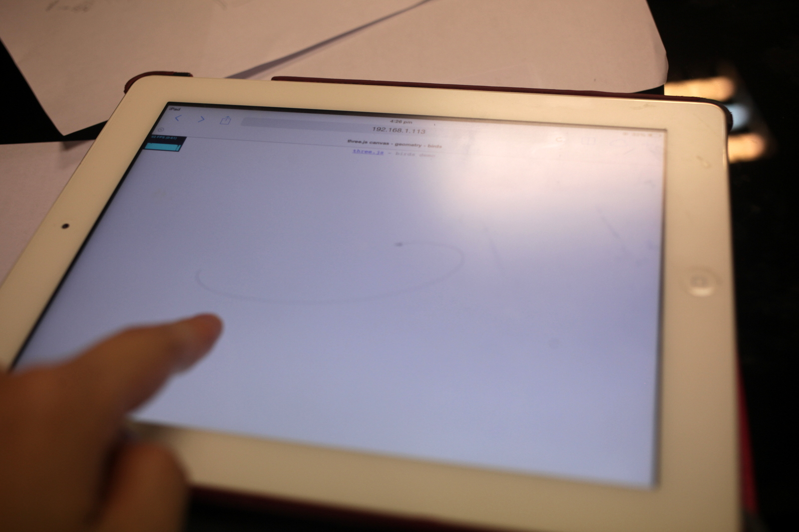
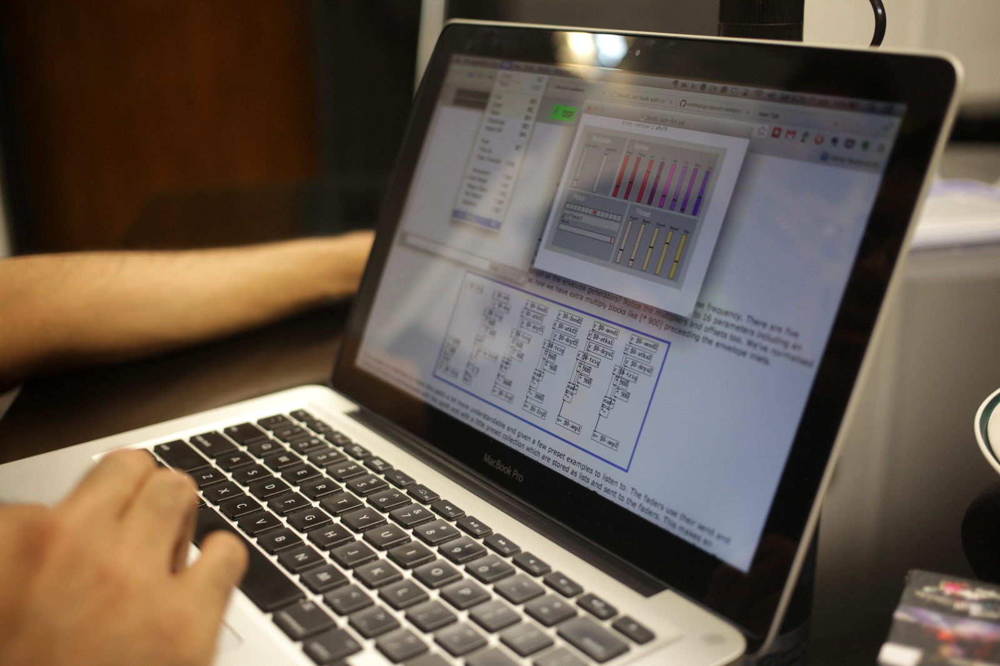

# 2.  The Idea
_tags: project developments_

_“There are a thousand thoughts lying within a man that he does not know till he takes up the pen to write.” ― William Makepeace Thackeray_

Finally to kick things off, we met up at HackerspaceSG for preliminary brainstorming. Chinmay was first to respond to my call for collabrators on Facebook, even though we knew other from geek events we attended in Singapore, this would be our first collabration.

It was a positive meetup, having fruitful discussions, exchanged ideas and managed expectations. Here's are some of the goals and objectives we agreed upon.

- we agree to focus upon a simple main theme
- we try to explore several extensions and sub-ideas, if we have the bandwidth after
- we aim to ship a prototype by 16 March (an intensive 2-week sprint)
- we want this to be a great experience for us (both for learning experience and the process)

With time constrains in mind, we decide to take a more pragmatic approach with our roles. I wish to apply some of the experience I have exploring the beauty of flocking behavior. Chinmay has an expertise with acoustics and would hope to apply that knowledge here.

The theme we have is "Emotions in Motion". How can we create a work which envoke emotions in an installation? How can we create a work where any observer can be part of the produced art work?

## Components

Here's our plan. There will 2 main components users will see in the installation.

### Emo Pad (Working Title)

The first is what we call the "Emo Pad". It would be a touchscreen device that users can interact with. It allows a user explore and find a color that represents them or that they are comfortable with. A little bird will birth with the color, and the user would be able to interact with it intimately with touch controls. However, the bird invokes a feeling of loneliness, since it appears trapped in the app. To free the bird from its lonely misery, the user swipe the device in a guesture for the bird to fly out of the Emo Pad into the Landscape Canvas to find its flock of other released birds.

### Landscape Canvas (Working Title)

Next component is the "Landscape Canvas". It would be a large panoramic display(s) that allows user to be imersed with. Freed birds from the Emo Pad would fly freely in this digital landscape. The canvas would take a life on its own, display beautiful aerial performances by the user generated birds. Behind the displays are speakers that would produces synthesized birds calls, as well as auto generated music that adds the sense of calmness and nature into the installation.

-- Josh, with Chinmay

## Sketches

installation sketch

technical architecture sketch

## Photos

installation sketch

Emo Protoype

Exploring Bird Synthesis