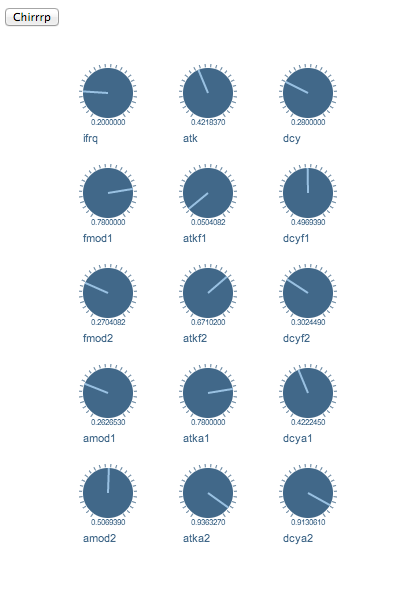

# Week 1 Development Updates

_tags: development updates

Development Updates as of 8 March, end of Week 1.

## Video demos of experiments

Running Bird Synths on the iPad.
<iframe class="vine-embed" src="https://vine.co/v/MA9LIgrrPHM/embed/simple?audio=1" width="600" height="600" frameborder="0"></iframe>

Testing Colored Birds
<iframe class="vine-embed" src="https://vine.co/v/MqbtZw0AWQ3/embed/simple" width="600" height="600" frameborder="0"></iframe>

Motion Blur on Black Background
<iframe class="vine-embed" src="https://vine.co/v/MqbFXi73gO0/embed/simple" width="600" height="600" frameborder="0"></iframe>

Motion Blur on White Background
<iframe class="vine-embed" src="https://vine.co/v/MqbUiqXaXuq/embed/simple" width="600" height="600" frameborder="0"></iframe>

Camera Following Bird's GPU position
<iframe class="vine-embed" src="https://vine.co/v/MqOOdKbFVZX/embed/simple" width="600" height="600" frameborder="0"></iframe>

Bird Calls Voice Presets
<iframe class="vine-embed" src="https://vine.co/v/MqOjUBzqtBH/embed/simple?audio=1" width="600" height="600" frameborder="0"></iframe>

Synthesized Bird Calls with 3D positioning
<iframe class="vine-embed" src="https://vine.co/v/MqOIrUbDjAB/embed/simple?audio=1" width="600" height="600" frameborder="0"></iframe>

Coding Flock of synthesize birds sounds
<iframe class="vine-embed" src="https://vine.co/v/MqOTuMbYFFO/embed/simple?audio=1" width="600" height="600" frameborder="0"></iframe>

## WIP Screenshots

Controls for Synthesized Birds

## Josh Development logs

March 3 - Started playing with [xgui](http://oos.moxiecode.com/js_canvas/xgui/) for colors. This library seems pretty useful and promising although it does not seem to be popular. Ended up trying to add [touch handling fixes](https://github.com/oosmoxiecode/xgui.js/pull/5) in xgui to make it work on iOS.

March 4 - Create initial touch based color pickers.

March 5 - Experiment with swipe gestures

March 6 - Help [test bird synths](https://notthetup.github.com/birds).

-- Josh, with Chinmay