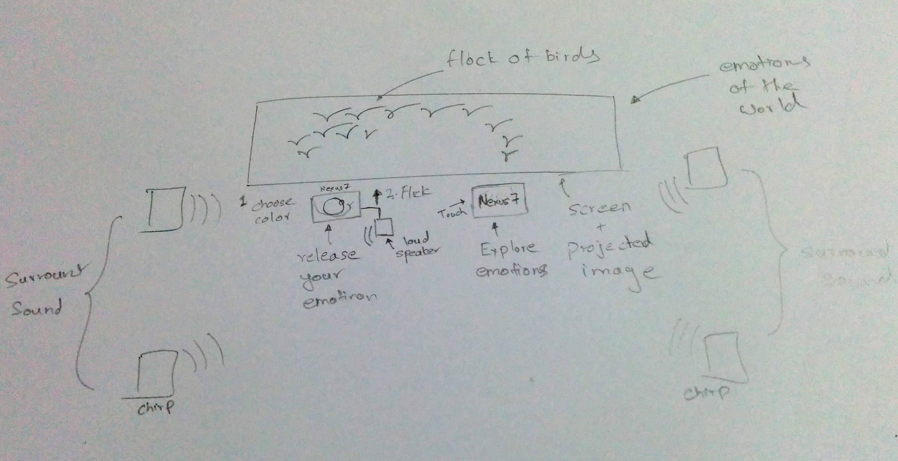

# Installation Vision.

We didn't have a time to model the installation, so we'll just describe the installation.

## Projector + Screen

The center of the installation is a projection of the 3D rendered birds on a large screen. The flying birds represent the emotions of the world. The various colours indicate the different emotions of people living around us.

## Explore the emotions

Using an touch enabled surface (Nexus Tablet) placed under the screen, audience can interact with the world of emotions. The birds on the large screen will react to the touch of the audience and scatter and flock, just like emotions in our world.

## Release your Emotion

If the audience member chooses, he or she can leave contribute their emotion to the flock of emotions on the screen. Here the audience member will interact with another touch enabled surface (Nexus Tablet), which allows the audience member to choose a color of bird he wants to release. This would indicate the emotion he/she wishes to leave with the flock. And a upwards flick gesture would release the bird to join the rest of the flock.

## Audio
The flock of birds on the large screen chirp and the cacophony of emotion is heard through a multi-channel audio system, giving sense of realism. When choosing and releasing your emotion, a small loudspeaker underneath the touch enabled device will output audio relevant to that bird.

Chinmay, with Josh
