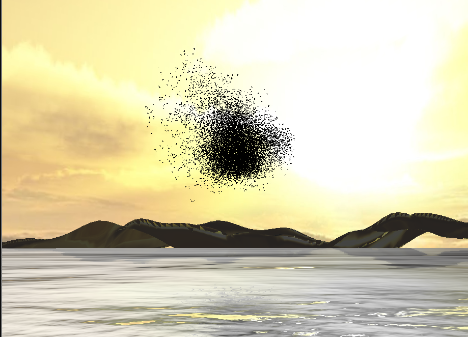
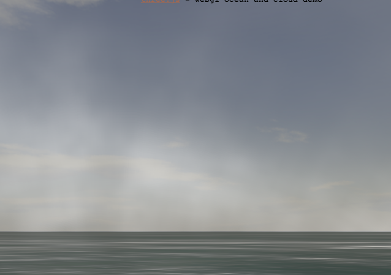
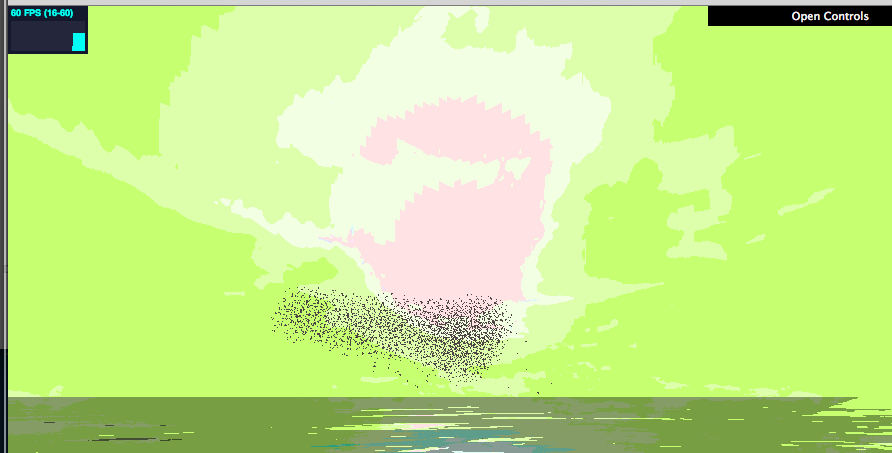
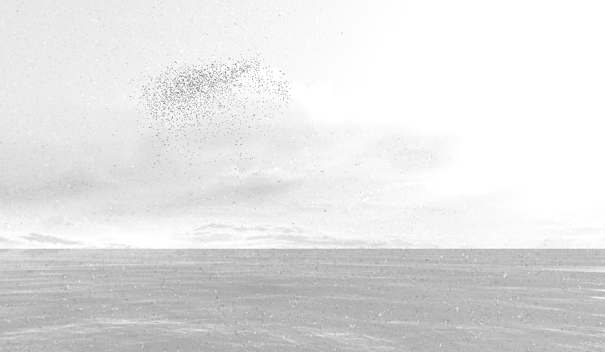
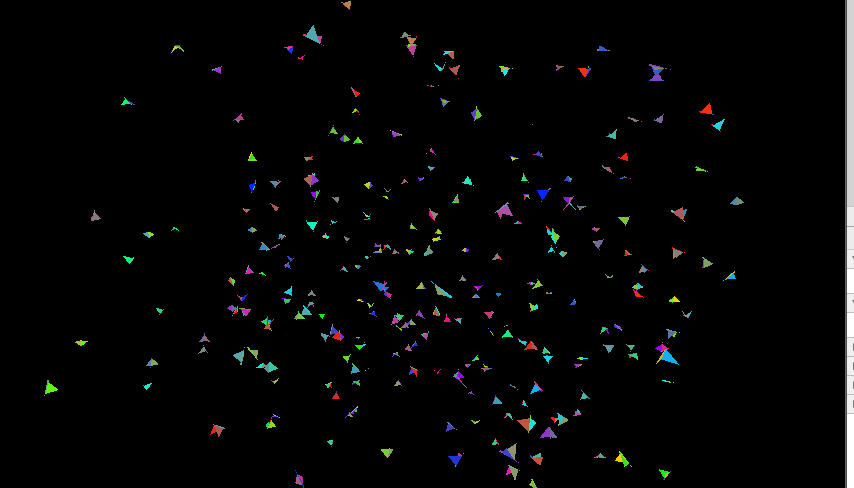
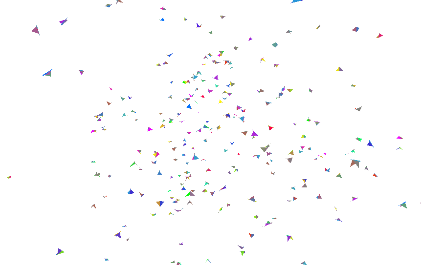
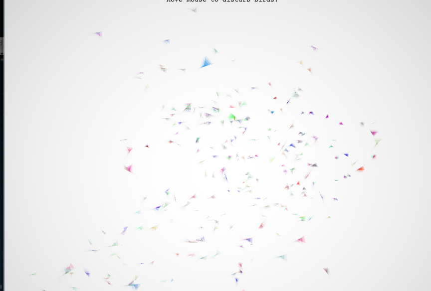

# Realistic vs Artistic Approach

One of the biggest choices for rendering the canvas module was to decide whether to use a more realistiic or more abstract version of rendering.

##Realistic
The realistic approach is to add more realistic enviornment, for example mountians, oceans, and skies.

Also tried adding clouds and fogs.

Then started experimenting with NPR (Non Photo-realistic Rendering). Toon shading which didn't went to well.

Tried some grayscale / pencil / cross-hatching toning

##Abstract

Needed more time to try other NPR styles (eg. watercolor, painting), so opted to try some abstract styles instead.

Dark background

Light background

Motion Blur background

The finalized approach uses a blended retained backbuffer for motion blur, multiplied with a original render colors.