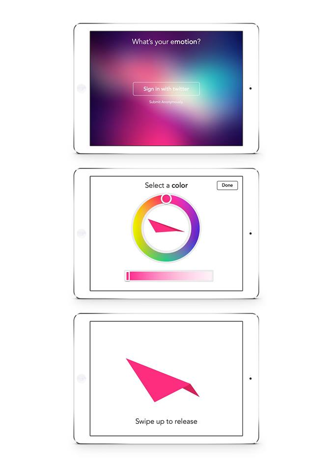

# Emotions in Motion

## Authors
- [Joshua Koo](http://twitter.com/blurspline), [zz85](https://github.com/zz85)
- [Chinmay Pendharkar](http://chinpen.net/), [notthetup](https://github.com/notthetup)

## Description
"Emotions in Motion" is currently a work-in-progress experiment to invoke and express emotions using motion + art + code.

The project explore our relationship with emotions, colours and sounds. And also the place of our emotions in the world of emotions.

## Link to Prototype
- [Emotion Release Screen](./project_code/release-screen/release.html)
- [Main Screen](./project_code/main-screen/screen.html)

## Example Code
The entire project is implemented in HTML/JS/CSS technologies. The project can be easily launched by opening the relevant HTML pages in modern browsers. :)

## Links to External Libraries
External libraries used on this project.

[Three.js](http://threejs.org "Three.js") - for 3D rendering in the browser
[xgui.js](http://oos.moxiecode.com/js_canvas/xgui/ "xgui.js") - controls for experimentation

## Images & Videos

Emo Module

Controls for Synthesized Birds
